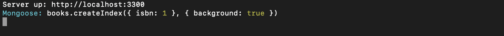
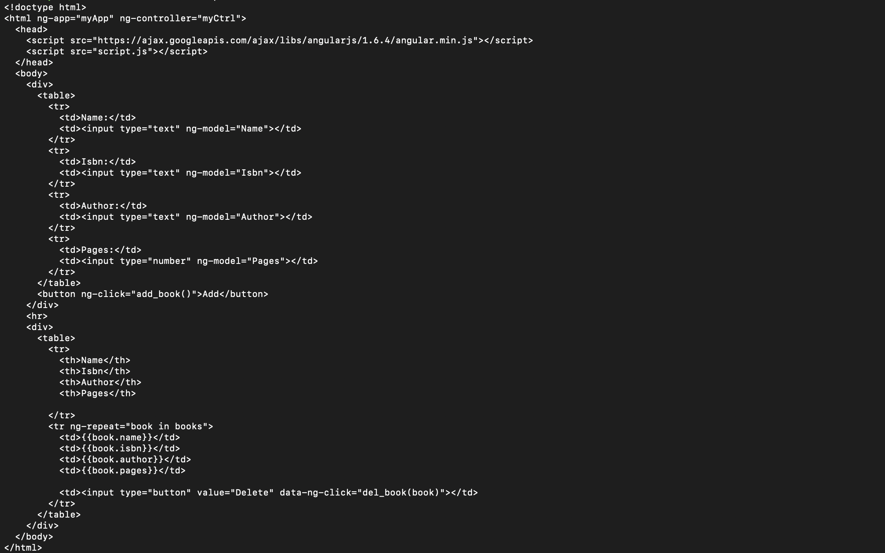
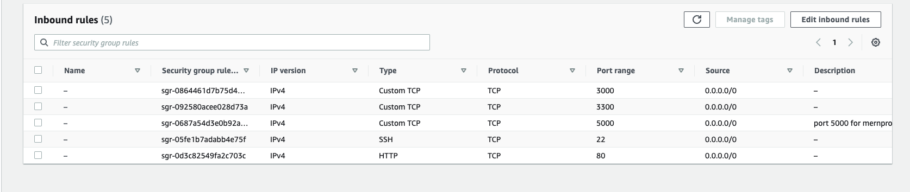
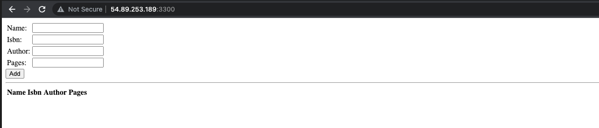

## Web (MEAN) Stack implementation in AWS.

#This project demonstrates how to build a MEAN Stack on AWS. MERN stack consists of MongoDB, ExpressJS, ReactJS and Node.js. Our goal here is to implement a simple Book Register web form using MEAN stack.


## .............................. Step 1: Launch an Ubuntu Server on AWS ..............................

For this project, we will need a virtual server with Ubuntu Server OS.

Sign in as either the root/IAM user (good practice is to create an IAM user and not use the root user to create resources on AWS).
Create and launch an Ubuntu EC2 instance (check videos below on how to set up your AWS account and launch your first EC2 instance).

- [AWS account setup and Provisioning an Ubuntu Server] (https://www.youtube.com/watch?v=xxKuB9kJoYM&list=PLtPuNR8I4TvkwU7Zu0l0G_uwtSUXLckvh&index=6)
- [Connecting to your EC2 Instance] (https://www.youtube.com/watch?v=TxT6PNJts-s&list=PLtPuNR8I4TvkwU7Zu0l0G_uwtSUXLckvh&index=7)

## .............................. Step 2: Install NodeJs ..............................

Node.js is a JavaScript runtime built on Chrome’s V8 JavaScript engine. We are using Node.js in this tutorial to set up the Express routes and AngularJS controllers.

Update and Upgrade your Ubuntu instance:

**`sudo apt update`**
**`sudo apt upgrade`**

Next, we add certificates:

**`sudo apt -y install curl dirmngr apt-transport-https lsb-release ca-certificates`**

**`curl -sL https://deb.nodesource.com/setup_12.x | sudo -E bash -`**

Install NodeJS

**`sudo apt install -y nodejs`**


## .............................. Step 3: Install MongoDB ..............................

MongoDB stores data in flexible, JSON-like documents. Fields in a database can vary from document to document and data structure can be changed over time. For our simple Book Register web application, we will be adding book records to MongoDB that contain book name, isbn number, author and number of pages. 

```
sudo apt-key adv --keyserver hkp://keyserver.ubuntu.com:80 --recv 0C49F3730359A14518585931BC711F9BA15703C6
echo "deb [ arch=amd64 ] https://repo.mongodb.org/apt/ubuntu trusty/mongodb-org/3.4 multiverse" | sudo tee /etc/apt/sources.list.d/mongodb-org-3.4.list

```
Install MongoDB:

**`sudo apt install -y mongodb`**

Start the MongoDB service:

**`sudo service mongodb start`**

Verify that the service is up and running:

**`sudo systemctl status mongodb`**


Install [npm](https://www.npmjs.com/) - Node package manager:

**`sudo apt install -y npm`**

We will be using the [body-parser](https://www.npmjs.com/package/body-parser) package to help us process JSON files passed in requests to the server. Install body-parser package:

**`sudo npm install body-parse`**


Create a folder named 'Books' and change directory into the folder.

**`mkdir Books && cd Books`**

Initialize the npm project in the Books directory:

**`npm init`**


Create and add a file names server.js:

**`vi server.js`**

Copy and paste the web server code below into the file and save:

```
var express = require('express');
var bodyParser = require('body-parser');
var app = express();
app.use(express.static(__dirname + '/public'));
app.use(bodyParser.json());
require('./apps/routes')(app);
app.set('port', 3300);
app.listen(app.get('port'), function() {
    console.log('Server up: http://localhost:' + app.get('port'));
});

```

## .............................. Step 4: Install Express ..............................

Express is a minimal and flexible Node.js web application framework that provides features for web and mobile applications. We will use Express to pass book information to and from our MongoDB database.

We also will use [Mongoose](https://mongoosejs.com/) package which provides a straight-forward, schema-based solution to model your application data. We will use Mongoose to establish a schema for the database to store data of our book register.

Install Express and Mongoose:

**`sudo npm install express mongoose`**

In the Books folder, create a folder named apps and change directory into it:

**`mkdir apps && cd apps`**

Create a file named routes.js, copy the code below into it and save the file:

```
var Book = require('./models/book');
module.exports = function(app) {
  app.get('/book', function(req, res) {
    Book.find({}, function(err, result) {
      if ( err ) throw err;
      res.json(result);
    });
  }); 
  app.post('/book', function(req, res) {
    var book = new Book( {
      name:req.body.name,
      isbn:req.body.isbn,
      author:req.body.author,
      pages:req.body.pages
    });
    book.save(function(err, result) {
      if ( err ) throw err;
      res.json( {
        message:"Successfully added book",
        book:result
      });
    });
  });
  app.delete("/book/:isbn", function(req, res) {
    Book.findOneAndRemove(req.query, function(err, result) {
      if ( err ) throw err;
      res.json( {
        message: "Successfully deleted the book",
        book: result
      });
    });
  });
  var path = require('path');
  app.get('*', function(req, res) {
    res.sendfile(path.join(__dirname + '/public', 'index.html'));
  });
};
```

In the apps folder, create a folder named models and change directory into it:

**`mkdir models && cd models`**

Create a file named book.js, copy the code below into it and save the file:

```
var mongoose = require('mongoose');
var dbHost = 'mongodb://localhost:27017/test';
mongoose.connect(dbHost);
mongoose.connection;
mongoose.set('debug', true);
var bookSchema = mongoose.Schema( {
  name: String,
  isbn: {type: String, index: true},
  author: String,
  pages: Number
});
var Book = mongoose.model('Book', bookSchema);
module.exports = mongoose.model('Book', bookSchema);
```

## .............................. Step 5: Access the routes with AngularJS ..............................

[AngularJS](https://angularjs.org/) provides a web framework for creating dynamic views in your web applications. In this tutorial, we use AngularJS to connect our web page with Express and perform actions on our book register.

Change directory back to the Books folder:

**`cd ../..`**

Create a folder named public and change directory into it:

**`mkdir public && cd public`**

Create a file named script.js, copy the code below into it and save the file:

**`vi script.js`**

Copy and paste the code below (controller configuration defined) into the script.js file:

```
var app = angular.module('myApp', []);
app.controller('myCtrl', function($scope, $http) {
  $http( {
    method: 'GET',
    url: '/book'
  }).then(function successCallback(response) {
    $scope.books = response.data;
  }, function errorCallback(response) {
    console.log('Error: ' + response);
  });
  $scope.del_book = function(book) {
    $http( {
      method: 'DELETE',
      url: '/book/:isbn',
      params: {'isbn': book.isbn}
    }).then(function successCallback(response) {
      console.log(response);
    }, function errorCallback(response) {
      console.log('Error: ' + response);
    });
  };
  $scope.add_book = function() {
    var body = '{ "name": "' + $scope.Name + 
    '", "isbn": "' + $scope.Isbn +
    '", "author": "' + $scope.Author + 
    '", "pages": "' + $scope.Pages + '" }';
    $http({
      method: 'POST',
      url: '/book',
      data: body
    }).then(function successCallback(response) {
      console.log(response);
    }, function errorCallback(response) {
      console.log('Error: ' + response);
    });
  };
});
```

In the public folder, create a file named index.html. Copy the HTML code below into it and save te file.

**`vi index.html`**

```
<!doctype html>
<html ng-app="myApp" ng-controller="myCtrl">
  <head>
    <script src="https://ajax.googleapis.com/ajax/libs/angularjs/1.6.4/angular.min.js"></script>
    <script src="script.js"></script>
  </head>
  <body>
    <div>
      <table>
        <tr>
          <td>Name:</td>
          <td><input type="text" ng-model="Name"></td>
        </tr>
        <tr>
          <td>Isbn:</td>
          <td><input type="text" ng-model="Isbn"></td>
        </tr>
        <tr>
          <td>Author:</td>
          <td><input type="text" ng-model="Author"></td>
        </tr>
        <tr>
          <td>Pages:</td>
          <td><input type="number" ng-model="Pages"></td>
        </tr>
      </table>
      <button ng-click="add_book()">Add</button>
    </div>
    <hr>
    <div>
      <table>
        <tr>
          <th>Name</th>
          <th>Isbn</th>
          <th>Author</th>
          <th>Pages</th>

        </tr>
        <tr ng-repeat="book in books">
          <td>{{book.name}}</td>
          <td>{{book.isbn}}</td>
          <td>{{book.author}}</td>
          <td>{{book.pages}}</td>

          <td><input type="button" value="Delete" data-ng-click="del_book(book)"></td>
        </tr>
      </table>
    </div>
  </body>
</html>
```
Change the directory back up to Books

**`cd ..`**

Start the server by running this command:

**`node server.js`**



Once confirmed that the server is up and running, we can connect it via port 3300. Launch a separate Putty or SSH console to test what curl command returns locally.

**`curl -s http://localhost:3300`**



The output or response will be an HTML page which may be hard to read in the CLI. We will access it on the internet by first opening TCP port 3300 in the security group of our EC2 instance on AWS.

## **Next, we need to open this port in the EC2 Security Groups. We will add a custom inbound rule to open port 3300:**



Now you we can access our Book Register web application from the Internet with a browser using the Public IP address or Public DNS name of our AWS Ubuntu server.

Quick reminder how to get your server’s Public IP and public DNS name:

You can find it in your AWS web console in EC2 details:

Run curl -s http://169.254.169.254/latest/meta-data/public-ipv4 for Public IP address or curl -s http://169.254.169.254/latest/meta-data/public-hostname for Public DNS name.

Our Web Book Register Application will look like in browser:



**This is the end of this project.**