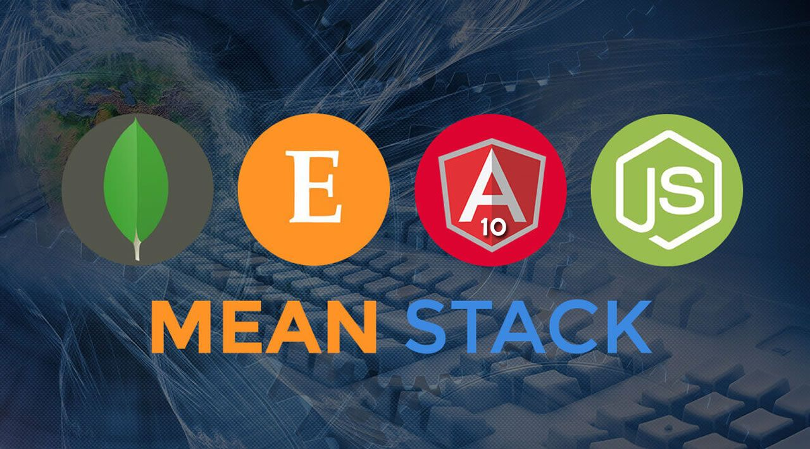

## Web (MEAN) Stack implementation in AWS.

#This project demonstrates how to build a MEAN Stack on AWS. MERN stack consists of MongoDB, ExpressJS, ReactJS and Node.js. Our goal here is to implement a simple Book Register web form using MEAN stack.



## .............................. Step 1: Launch an Ubuntu Server on AWS ..............................

For this project, we will need a virtual server with Ubuntu Server OS.

Sign in as either the root/IAM user (good practice is to create an IAM user and not use the root user to create resources on AWS).
Create and launch an Ubuntu EC2 instance (check videos below on how to set up your AWS account and launch your first EC2 instance).

- [AWS account setup and Provisioning an Ubuntu Server] (https://www.youtube.com/watch?v=xxKuB9kJoYM&list=PLtPuNR8I4TvkwU7Zu0l0G_uwtSUXLckvh&index=6)
- [Connecting to your EC2 Instance] (https://www.youtube.com/watch?v=TxT6PNJts-s&list=PLtPuNR8I4TvkwU7Zu0l0G_uwtSUXLckvh&index=7)

## .............................. Step 2: Install NodeJs ..............................

Node.js is a JavaScript runtime built on Chrome’s V8 JavaScript engine. We are using Node.js in this tutorial to set up the Express routes and AngularJS controllers.

Update and Upgrade your Ubuntu instance:

**`sudo apt update`**
**`sudo apt upgrade`**

Next, we add certificates:

**`sudo apt -y install curl dirmngr apt-transport-https lsb-release ca-certificates`**

**`curl -sL https://deb.nodesource.com/setup_12.x | sudo -E bash -`**

Install NodeJS

**`sudo apt install -y nodejs`**


## .............................. Step 3: Install MongoDB ..............................

MongoDB stores data in flexible, JSON-like documents. Fields in a database can vary from document to document and data structure can be changed over time. For our simple Book Register web application, we will be adding book records to MongoDB that contain book name, isbn number, author and number of pages. 

```
sudo apt-key adv --keyserver hkp://keyserver.ubuntu.com:80 --recv 0C49F3730359A14518585931BC711F9BA15703C6
echo "deb [ arch=amd64 ] https://repo.mongodb.org/apt/ubuntu trusty/mongodb-org/3.4 multiverse" | sudo tee /etc/apt/sources.list.d/mongodb-org-3.4.list

```
Install MongoDB:

**`sudo apt install -y mongodb`**

Start the MongoDB service:

**`sudo service mongodb start`**

Verify that the service is up and running:

**`sudo systemctl status mongodb`**


Install [npm](https://www.npmjs.com/) - Node package manager:

**`sudo apt install -y npm`**

We will be using the [body-parser](https://www.npmjs.com/package/body-parser) package to help us process JSON files passed in requests to the server. Install body-parser package:

**`sudo npm install body-parse`*


Create a folder named 'Books' and change directory into the folder.

**`mkdir Books && cd Books`**

Initialize the npm project in the Books directory:

**`npm init`**


Create and add a file names server.js:

**`vi server.js`**

Copy and paste the web server code below into the file and save:

```
var express = require('express');
var bodyParser = require('body-parser');
var app = express();
app.use(express.static(__dirname + '/public'));
app.use(bodyParser.json());
require('./apps/routes')(app);
app.set('port', 3300);
app.listen(app.get('port'), function() {
    console.log('Server up: http://localhost:' + app.get('port'));
});

```