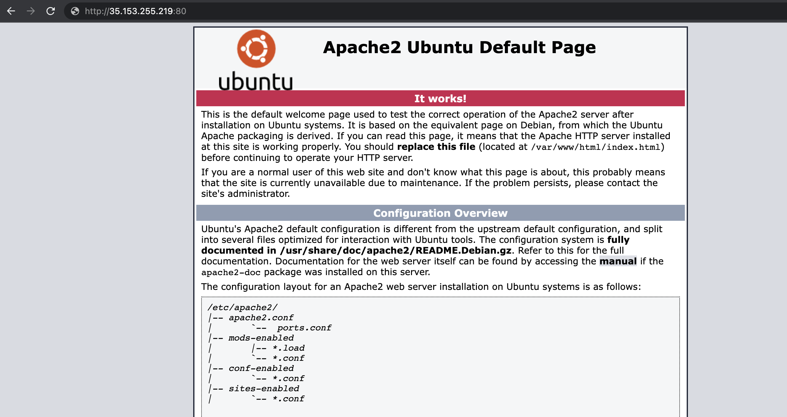

## Web (LAMP) Stack implementation in AWS.

#This project demonstrates how to build a LAMP Stack on AWS.

## .............................. Step 1: Installing Apache and Updating the Firewall ..............................

Sign in as either the root/IAM user (good practice is to create an IAM user and not use the root user to create resources on AWS).
Launch the Ubuntu EC2 instance (check videos below on how to set up your AWS account and launch your first EC2 instance).

- [AWS account setup and Provisioning an Ubuntu Server] (https://www.youtube.com/watch?v=xxKuB9kJoYM&list=PLtPuNR8I4TvkwU7Zu0l0G_uwtSUXLckvh&index=6)
- [Connecting to your EC2 Instance] (https://www.youtube.com/watch?v=TxT6PNJts-s&list=PLtPuNR8I4TvkwU7Zu0l0G_uwtSUXLckvh&index=7)

Update your Ubuntu instance with:

**`sudo apt update`**

Once the update is completed, install Apache using Ubuntu’s package manager ‘apt’:

**`sudo apt install apache2`**

Verify that apache2 service is running on the Ubuntu instance:

**`sudo systemctl status apache2`**

Image below shows that Apache is active and running on my Ubuntu instance:

Open TCP port 80 which is the default port that web browsers use to access web pages on the Internet so that the web server can receive traffic. To do this, edit the inbound rules on the security group attached to your Ubuntu instance to allow traffic from port 80.

Check using either of the command below to confirm the server can be accessed locally:

**`curl http://localhost:80  
or curl http://<public address>:80`**

Result:

Next, we check that the server can be accessed from the internet. On any browser, open a tab and go to http://<Ubuntu-Instance-Public-IP-Address>:80

## .............................. Step 2: Installing MySQL ..............................
