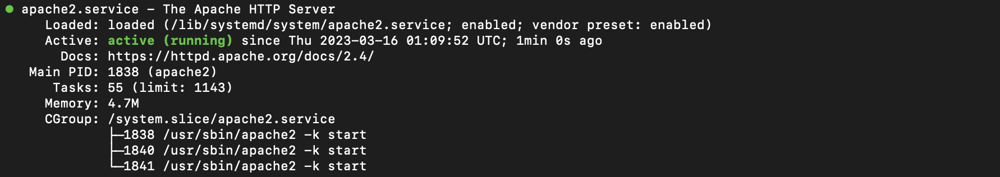
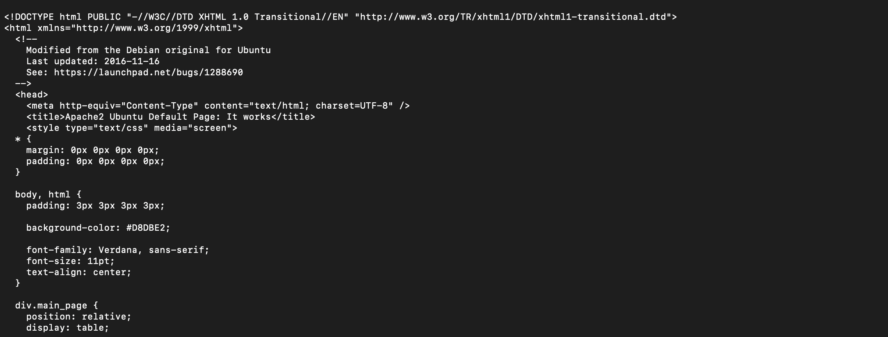
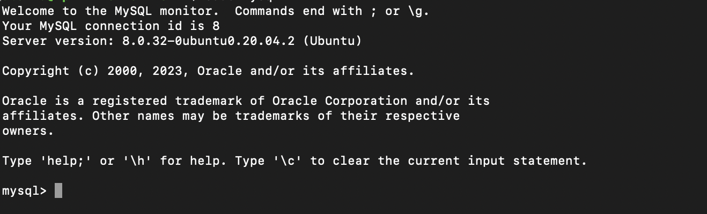
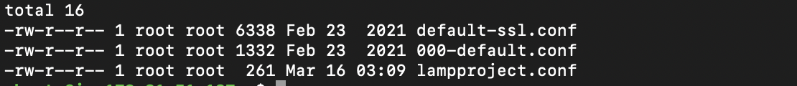
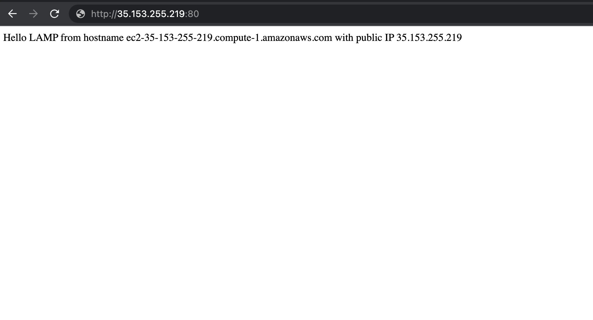

## Web (LAMP) Stack implementation in AWS.

#This project demonstrates how to build a LAMP Stack on AWS.

## .............................. Step 1: Installing Apache and Updating the Firewall ..............................

Purpose: to serve content users will see.

Sign in as either the root/IAM user (good practice is to create an IAM user and not use the root user to create resources on AWS).
Launch the Ubuntu EC2 instance (check videos below on how to set up your AWS account and launch your first EC2 instance).

- [AWS account setup and Provisioning an Ubuntu Server] (https://www.youtube.com/watch?v=xxKuB9kJoYM&list=PLtPuNR8I4TvkwU7Zu0l0G_uwtSUXLckvh&index=6)
- [Connecting to your EC2 Instance] (https://www.youtube.com/watch?v=TxT6PNJts-s&list=PLtPuNR8I4TvkwU7Zu0l0G_uwtSUXLckvh&index=7)

Update your Ubuntu instance with:

**`sudo apt update`**

Once the update is completed, install Apache using Ubuntu’s package manager ‘apt’:

**`sudo apt install apache2`**

Verify that apache2 service is running on the Ubuntu instance:

**`sudo systemctl status apache2`**

Image below shows that Apache is active and running on my Ubuntu instance:



Open TCP port 80 which is the default port that web browsers use to access web pages on the Internet so that the web server can receive traffic. To do this, edit the inbound rules on the security group attached to your Ubuntu instance to allow traffic from port 80.


Check using either of the command below to confirm the server can be accessed locally:

**`curl http://localhost:80  
or curl http://<public address>:80`**

Result:



Next, we check that the server can be accessed from the internet. On any browser, open a tab and go to http://<Ubuntu-Instance-Public-IP-Address>:80


## .............................. Step 2: Installing MySQL ..............................

Purpose: to store, manage and retrieve data.

Installl MySQL on the Ubuntun instance:

 **`sudo apt install mysql-server -y`**

After the installation is completed, log in to the MySQL console:

**`sudo mysql`**



Set a password for the root user, using mysql_native_password as default authentication method. 

**`ALTER USER 'root'@'localhost' IDENTIFIED WITH mysql_native_password BY '<YOUR_PASSWORD_HERE>';`**

Exit the MySQL shell with **`EXIT`**

It is recommended to run  interactive security script that comes pre-installed with MySQL to remove some insecure default setting and lock down access to your database system.

Start the script using **`sudo mysql_secure_installation`**


After the script has finished executing, check if you can log in to the MySQL console by typing **`sudo mysql -p`**

## .............................. Step 3: Installing PHP ..............................

Purpose: process code to display dynamic content to end user.

We need three packages which are the **`php`** package that will process code to display dynamic content to end user, the **`php-mysql`** PHP module that allows PHP to communicate with MySQL-based databases, and finally the **`libapache2-mod-php`** to enable Apache to handle PHP files. The core PHP packages will automatically be installed as dependencies.

Installing the three packages at once using: 

**`sudo apt install php php-mysql libapache2-mod-php`**

After the installation, verify the PHP version with the command below:

**`php -v`**


Set up of the LAMP stack is complete with:

- [x] Linux
- [x] Apache Http Server
- [x] MySQL
- [x] PHP

## .............................. Step 4: Creating Virtual Host for our Website Using Apache ..............................

Purpose: to test the LAMP setup with a PHP script using a Apache Virtual Host to hold our website’s files and folders. The Virtual host allows us to have multiple websites located on a single machine. In this steep, we will set up a domain called lampproject.

Create the directory for the lampproject using ‘mkdir’ command:

**`sudo mkdir /var/www/lampproject`**

Next, we need to assign ownership of the directory with our current system user:

**`sudo chown -R $USER:$USER /var/www/lampproject`**

Create and open a new configuration file in Apache’s sites-available directory using your preferred command-line editor:

**`sudo vi /etc/apache2/sites-available/lampproject.conf`**

Paste the following bare-bones configuration in the blank file and save:

```
<VirtualHost *:80>
    ServerName lampproject
    ServerAlias www.lampproject 
    ServerAdmin webmaster@localhost
    DocumentRoot /var/www/lampproject
    ErrorLog ${APACHE_LOG_DIR}/error.log
    CustomLog ${APACHE_LOG_DIR}/access.log combined
</VirtualHost>
```
You can use the ls command to show the new file in the sites-available directory

**`sudo ls /etc/apache2/sites-available -lrt`**

Result:



With this VirtualHost configuration, Apache will serve lampproject using /var/www/lampproject as its web root directory. 

Enable the new virtual host using the a2ensite command:

**`sudo a2ensite lampproject`**

Disable the default website that comes installed with Apache. This is required if you’re not using a custom domain name, because in this case Apache’s default configuration would overwrite your virtual host. To disable Apache’s default website use a2dissite command as shown below:

**`sudo a2dissite 000-default`**

Ensure the configuration file doesn’t contain syntax errors using:

**`sudo apache2ctl configtest`**

You should get: ```Syntax OK```

Lastly, reload Apache for the changes to take effect:

**`sudo systemctl reload apache2`**

Create an index.html file in the web root /var/www/lampproject to test that the virtual host works as expected:

**```
sudo echo 'Hello LAMP from hostname' $(curl -s http://169.254.169.254/latest/meta-data/public-hostname) 'with public IP' $(curl -s http://169.254.169.254/latest/meta-data/public-ipv4) > /var/www/lampproject/index.html
```**

From your browser, open your website URL using IP address:

**`http://<Ubuntu-Public-IP-Address>:80`**



## .............................. Step 5: Enable PHP on the website ..............................