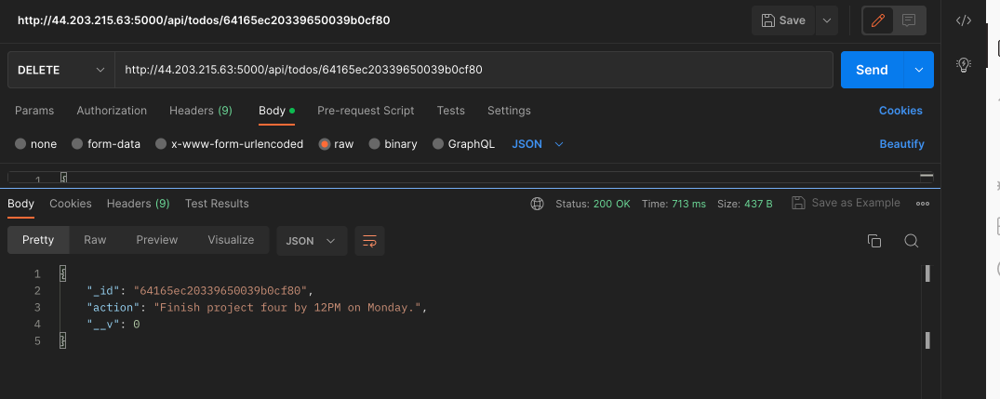

## Web (MERN) Stack implementation in AWS.

#This project demonstrates how to build a MERN Stack on AWS. MERN stack consists of MongoDB, ExpressJS, ReactJS and Node.js. Our goal here is to deploy a simple to-do application.


As shown in the above illustration, a user interacts with the ReactJS UI components at the application front-end residing in the browser. This frontend is served by the application backend residing in a server, through ExpressJS running on top of NodeJS.

Any interaction that causes a data change request is sent to the NodeJS based Express server, which grabs data from the MongoDB database if required, and returns the data to the frontend of the application, which is then presented to the user.

## .............................. Step 1: Launch an Ubuntu Server on AWS ..............................

For this project, we will need a virtual server with Ubuntu Server OS.

Sign in as either the root/IAM user (good practice is to create an IAM user and not use the root user to create resources on AWS).
Create and launch an Ubuntu EC2 instance (check videos below on how to set up your AWS account and launch your first EC2 instance).

- [AWS account setup and Provisioning an Ubuntu Server] (https://www.youtube.com/watch?v=xxKuB9kJoYM&list=PLtPuNR8I4TvkwU7Zu0l0G_uwtSUXLckvh&index=6)
- [Connecting to your EC2 Instance] (https://www.youtube.com/watch?v=TxT6PNJts-s&list=PLtPuNR8I4TvkwU7Zu0l0G_uwtSUXLckvh&index=7)

## .............................. Step 2: Backend configuration ..............................

Purpose: to prepare our server, install nodejs, npm and initialise our project.

Update and upgrade your Ubuntu instance:

**`sudo apt update`**
**`sudo apt upgrade`**

Get the location of Node.js software from Ubuntu repositories:

**`curl -fsSL https://deb.nodesource.com/setup_18.x | sudo -E bash -`**

Install Node.js on the Ubuntu server:

**`sudo apt-get install -y nodejs`**

The command above installs both nodejs and npm. NPM is a package manager for Node like apt for Ubuntu, it is used to install Node modules & packages and to manage dependency conflicts.

Verify the node installation with the command below:

**`node -v`**

Verify the npm installation with the command below:

**`npm -v`**

## **Application Code Setup**

Create a new directory for the to-do project:

**`mkdir to-do`**

Run the command below to verify that the Todo directory is created with ls command

**`ls`**

Change your current directory to the newly created to-do directory:

**`cd to-do`**

You can confirm you are now in that directory using the pwd command:

**`pwd`**


Now, we need to initialise our project so that a new file named package.json will be created. This file will normally contain information about our application and the dependencies that it needs to run. Start by running the npm init command to initialise the project and follow the prompts after running the command. Use Enter to accept the default values, then accept to write out the package.json file by typing yes.

**`nmp init`**


Run the command ls to confirm that you have package.json file created.

**`ls`**


## **Install Expressjs**

Express is a framework for Node.js that simplifies development, and abstracts a lot of low level details. For example, Express helps to define routes of your application based on HTTP methods and URLs.

To use express, install it using npm:

**`npm install express`**

Create a index.js file in the to-do directory with the command below:

**`touch index.js`**

Confirm that the index.js file is successfully created using the ls command.

**`ls`**


Install the dotenc module:

**`npm install dotenv`**

Open the index.js file:

**`vim index.js`**

Type the code below into it and save

```
const express = require('express');
require('dotenv').config();

const app = express();

const port = process.env.PORT || 5000;

app.use((req, res, next) => {
res.header("Access-Control-Allow-Origin", "\*");
res.header("Access-Control-Allow-Headers", "Origin, X-Requested-With, Content-Type, Accept");
next();
});

app.use((req, res, next) => {
res.send('Welcome to Express');
});

app.listen(port, () => {
console.log(`Server running on port ${port}`)
});
```

Now, we will start the server to see if it works. Open the terminal in the to-do list directory where your index.js file is, and type:

**`node index.js`**

If everything is OK, you should see ```Server running on port 5000``` in your terminal as shown below. Remember we specified to use port 5000 in the index.js file we created.


## **Next, we need to open this port in the EC2 Security Groups. We will add a custom inbound rule to open port 5000:**


Open up your browser and try to access your Ubuntu server’s Public IP or Public DNS name followed by port 5000:

**`http://<Ubuntu-Public-IP-Address>:5000`**


## **Defining Routes for our App**

The to-do application must perform three actions: Create a new task, Display list of all tasks, Delete a completed task. Each task will be associated with some particular endpoint and will use different standard HTTP request methods: POST, GET, DELETE. Therefore, we need to create routes that will define various endpoints that the to-do app will depend on.

Create a new folder named routes:

**`mkdir routes`**

Change directory to routes folder:

**`cd routes`**

Now, create a file api.js with the command below:

**`touch api.js`**

Open the file with the command below:

**`vim api.js`**

Copy below code in the file and save it.

```
const express = require ('express');
const router = express.Router();

router.get('/todos', (req, res, next) => {

});

router.post('/todos', (req, res, next) => {

});

router.delete('/todos/:id', (req, res, next) => {

})

module.exports = router;
```

## **Creating Models**

We need to create a model since our app is going to make use of Mongodb which is a NoSQL database. A model is at the heart of JavaScript based applications, and it is what makes it interactive. We will also use models to define the database schema . This is important so that we will be able to define the fields stored in each Mongodb document. 

To create a Schema and a model, install mongoose which is a Node.js package that makes working with mongodb easier.

Change directory back Todo folder with cd .. to return to the to-do directory, and install Mongoose:

**`cd ..`**

**`npm install mongoose`**

Create a new folder models using:

**`mkdir models`**

Change directory into the newly created ‘models’ folder, and inside the folder create a file and name it todo.js

**`cd models && touch todo.js`**

Open the file created with **`vim todo.js`** then paste the code below in the file:

```
const mongoose = require('mongoose');
const Schema = mongoose.Schema;

//create schema for todo
const TodoSchema = new Schema({
action: {
type: String,
required: [true, 'The todo text field is required']
}
})

//create model for todo
const Todo = mongoose.model('todo', TodoSchema);

module.exports = Todo;
```
Now we need to update our routes from the file api.js in ‘routes’ directory to make use of the new model.

From the todo directory, change directory to the routes folder:

**`cd routes`**

In the routes directory, open api.js with **`vim api.js`**, delete the code inside it with **`:%d`** and paste the code below. Save the file.

```
const express = require ('express');
const router = express.Router();
const Todo = require('../models/todo');

router.get('/todos', (req, res, next) => {

//this will return all the data, exposing only the id and action field to the client
Todo.find({}, 'action')
.then(data => res.json(data))
.catch(next)
});

router.post('/todos', (req, res, next) => {
if(req.body.action){
Todo.create(req.body)
.then(data => res.json(data))
.catch(next)
}else {
res.json({
error: "The input field is empty"
})
}
});

router.delete('/todos/:id', (req, res, next) => {
Todo.findOneAndDelete({"_id": req.params.id})
.then(data => res.json(data))
.catch(next)
})

module.exports = router;
```

## **MongoDB Database**

We need a database where we will store our data. For this we will make use of mLab. mLab provides MongoDB database as a service solution (DBaaS). 

Sign up [here](https://www.mongodb.com/atlas-signup-from-mlab) for a shared clusters free account. Follow the sign up process, select AWS as the cloud provider, and choose a region close to you.

[Dashboard](./images/atlasdashboard.png)

Allow access to the MongoDB database from anywhere (Not secure, but it is ideal for testing)

Click on Network Access and then on the EDIT button. On the next screen, select ALLOW ACCESS FROM ANYWHERE.


Create a MongoDB database and collection inside mLab.

 

In the index.js file, we specified process.env to access environment variables. Create a file in the todo directory and name it .env.

**`touch .env`**
**`vi .env`**

Add the connection string to access the database in it, just as below. Update <username>, <password>, <network-address> and <database> according to your setup.

```
DB = 'mongodb+srv://<username>:<password>@<network-address>/<dbname>?retryWrites=true&w=majority'
```
Here is how to get your connection string:


Update the index.js file to reflect the user of .env so that node.js can connect to the database. Open the file with **`vim index.js`**, delete the entire content with :%d, copy and past the entire code below into it. Save the file.

```
const express = require('express');
const bodyParser = require('body-parser');
const mongoose = require('mongoose');
const routes = require('./routes/api');
const path = require('path');
require('dotenv').config();

const app = express();

const port = process.env.PORT || 5000;

//connect to the database
mongoose.connect(process.env.DB, { useNewUrlParser: true, useUnifiedTopology: true })
.then(() => console.log(`Database connected successfully`))
.catch(err => console.log(err));

//since mongoose promise is depreciated, we overide it with node's promise
mongoose.Promise = global.Promise;

app.use((req, res, next) => {
res.header("Access-Control-Allow-Origin", "\*");
res.header("Access-Control-Allow-Headers", "Origin, X-Requested-With, Content-Type, Accept");
next();
});

app.use(bodyParser.json());

app.use('/api', routes);

app.use((err, req, res, next) => {
console.log(err);
next();
});

app.listen(port, () => {
console.log(`Server running on port ${port}`)
});
```

Using environment variables to store information is considered more secure and best practice to separate configuration and secret data from the application, instead of writing connection strings directly inside the index.js application file.

Start the server using the command below:

**`node index.js`**


The backend configuration is complete, and we will now test the server.

## **Testing Backend Code without Frontend using RESTful API**

Since we don't have frontend User Interface (UI) yet, we will use an API development client (Postman) to test our code. If you don't have postman on your PC, click [Install Postman](https://www.getpostman.com/downloads/). 

We will test all the API endpoints and make sure they are working. For the endpoints that require body, you should send JSON back with the necessary fields since it’s what we setup in our code.

Create a POST request to the API http://<PublicIP-or-PublicDNS>:5000/api/todos. This request sends a new task to our To-Do list so the application could store it in the database.

Note: make sure your set header key Content-Type as application/json


Add a body to the request and send:


We can also check our database to see how the requests are stored.


Create a GET request to the API http://<PublicIP-or-PublicDNS>:5000/api/todos. This request retrieves all existing records from out To-do application (backend requests these records from the database and sends it us back as a response to GET request).


Send a DELETE request to the API http://<PublicIP-or-PublicDNS>:5000/api/todos. This request deletes the record of the item specified in the request. You need to send the ID of the record as part of the DELETE request.



With this, we have confirmed that our backend part of our application is working with the three operations we wanted (GET, POST & DELETE).

- [x] Display a list of tasks – HTTP GET request
- [x] Add a new task to the list – HTTP POST request
- [x] Delete an existing task from the list – HTTP DELETE request

## .............................. Step 3: Frontend creation ..............................

Purpose: to create a user interface for a web client (browser) to interact with the application via API.

To start withm we will use the create-react-app command to scaffold our app. In the same root directory as your backend code (the to-do directory), run:

**` npx create-react-app client`**

This will create a new folder in your Todo directory called client, where you will add all the react code.


## **Running a React App**

We need to install some dependencies before testing the react app.

Install concurrently - this is used to run more than one command simultaneously from the same terminal window.

**`npm install concurrently --save-dev`**

Install nodemon - it is used to run and monitor the server. If there is any changes in the server code, nodemon will restart it automatically and load the new changes.

**`npm install nodemon --save-dev`**

In the to-do folder, open the package.json file. Replace this part of the code:
```
"scripts": {
    "test": "echo \"Error: no test specified\" && exit 1"
},
```
With this code below:
```
"scripts": {
"start": "node index.js",
"start-watch": "nodemon index.js",
"dev": "concurrently \"npm run start-watch\" \"cd client && npm start\""
},
```

## **Configure Proxy in package.json**

Change directory to 'client' folder with **`cd client`**

Open the package.json file with **`vi package.json`**

Add the key value pair in the package.json file "proxy": "http://localhost:5000".

The purpose of adding the proxy configuration in number 3 above is to make it possible to access the application directly from the browser by simply calling the server url like http://localhost:5000 rather than always including the entire path like http://localhost:5000/api/todos


Inside the to-do directory, run the command below:

**`npm run dev`**

The app should open and start running on localhost:3000


In order to be able to access the application from the Internet we have to open TCP port 3000 on EC2 by adding a new inbound rule to the Security Group.


## **Creating the React Components**

For our to-do application, there will be two stateful components and one stateless component. 

From the to-do directory, change to thr src directory:

**`cd client/src`**

Inside your src folder create another folder called components:

**`mkdir components`**

Move into the components directory with

**`cd components`**

Inside the components directory, create three files Input.js, ListTodo.js and Todo.js.

**`touch Input.js ListTodo.js Todo.js`**


Open Input.js file

**`vi Input.js`**

Copy and past the following lines of codes in it. Save the file

```
import React, { Component } from 'react';
import axios from 'axios';

class Input extends Component {

state = {
action: ""
}

addTodo = () => {
const task = {action: this.state.action}

    if(task.action && task.action.length > 0){
      axios.post('/api/todos', task)
        .then(res => {
          if(res.data){
            this.props.getTodos();
            this.setState({action: ""})
          }
        })
        .catch(err => console.log(err))
    }else {
      console.log('input field required')
    }

}

handleChange = (e) => {
this.setState({
action: e.target.value
})
}

render() {
let { action } = this.state;
return (
<div>
<input type="text" onChange={this.handleChange} value={action} />
<button onClick={this.addTodo}>add todo</button>
</div>
)
}
}

export default Input
```

To make use of [Axios](https://github.com/axios/axios), which is a promise based HTTP client for the browser and node.js, cd into the to-do/client folder:

**`cd ../.. `**

Confirm you are in the clients folder with **`pwd`**


Install axios with **`npm install axios`** or **`yarn add axios`**

Go to components directory:

**`cd src/components`**

After that open the ListTodo.js

**`vi ListTodo.js`**

Copy and paste the following code into it and save.

```
import React from 'react';

const ListTodo = ({ todos, deleteTodo }) => {

return (
<ul>
{
todos &&
todos.length > 0 ?
(
todos.map(todo => {
return (
<li key={todo._id} onClick={() => deleteTodo(todo._id)}>{todo.action}</li>
)
})
)
:
(
<li>No todo(s) left</li>
)
}
</ul>
)
}

export default ListTodo
```

Open the Todo.js file, copy and paste the code below into it and save.

**`vi Todo.js`**

```
import React, {Component} from 'react';
import axios from 'axios';

import Input from './Input';
import ListTodo from './ListTodo';

class Todo extends Component {

state = {
todos: []
}

componentDidMount(){
this.getTodos();
}

getTodos = () => {
axios.get('/api/todos')
.then(res => {
if(res.data){
this.setState({
todos: res.data
})
}
})
.catch(err => console.log(err))
}

deleteTodo = (id) => {

    axios.delete(`/api/todos/${id}`)
      .then(res => {
        if(res.data){
          this.getTodos()
        }
      })
      .catch(err => console.log(err))

}

render() {
let { todos } = this.state;

    return(
      <div>
        <h1>My Todo(s)</h1>
        <Input getTodos={this.getTodos}/>
        <ListTodo todos={todos} deleteTodo={this.deleteTodo}/>
      </div>
    )

}
}

export default Todo;
```

Change directory to the /src folder using **`cd ..`**

In the src folder, open the App.js file

**`vi App.js`**

Delete the content of the file with :%d and past the following code in it. Save the file.

```
import React from 'react';

import Todo from './components/Todo';
import './App.css';

const App = () => {
return (
<div className="App">
<Todo />
</div>
);
}

export default App;
```

In the same src directory, open the App.css code. Delete the content of the file with :%d. Copy and paste the code below in it. Save the file.

**`vi App.css`**

```
.App {
text-align: center;
font-size: calc(10px + 2vmin);
width: 60%;
margin-left: auto;
margin-right: auto;
}

input {
height: 40px;
width: 50%;
border: none;
border-bottom: 2px #101113 solid;
background: none;
font-size: 1.5rem;
color: #787a80;
}

input:focus {
outline: none;
}

button {
width: 25%;
height: 45px;
border: none;
margin-left: 10px;
font-size: 25px;
background: #101113;
border-radius: 5px;
color: #787a80;
cursor: pointer;
}

button:focus {
outline: none;
}

ul {
list-style: none;
text-align: left;
padding: 15px;
background: #171a1f;
border-radius: 5px;
}

li {
padding: 15px;
font-size: 1.5rem;
margin-bottom: 15px;
background: #282c34;
border-radius: 5px;
overflow-wrap: break-word;
cursor: pointer;
}

@media only screen and (min-width: 300px) {
.App {
width: 80%;
}

input {
width: 100%
}

button {
width: 100%;
margin-top: 15px;
margin-left: 0;
}
}

@media only screen and (min-width: 640px) {
.App {
width: 60%;
}

input {
width: 50%;
}

button {
width: 30%;
margin-left: 10px;
margin-top: 0;
}
}
```
In the src directory, open the index.css file, delete the content of the file with :%d. Copy and paste the code below. Save it.

**`vi index.css`**

```
body {
margin: 0;
padding: 0;
font-family: -apple-system, BlinkMacSystemFont, "Segoe UI", "Roboto", "Oxygen",
"Ubuntu", "Cantarell", "Fira Sans", "Droid Sans", "Helvetica Neue",
sans-serif;
-webkit-font-smoothing: antialiased;
-moz-osx-font-smoothing: grayscale;
box-sizing: border-box;
background-color: #282c34;
color: #787a80;
}

code {
font-family: source-code-pro, Menlo, Monaco, Consolas, "Courier New",
monospace;
}
```
Go to the to-do directory:

**`cd ../..`**

In the directory, run:

**`npm run dev`**

If the successful, you should be able to access the app at in your browser


**This is the end of this project.**