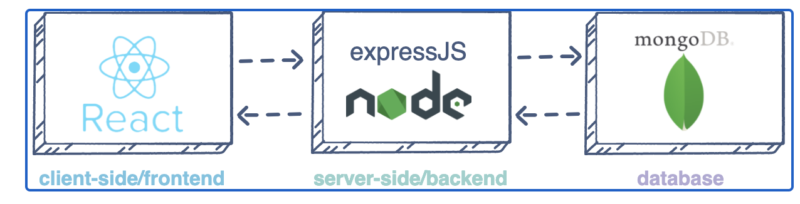

## Web (MERN) Stack implementation in AWS.

#This project demonstrates how to build a MERN Stack on AWS. MERN stack consists of MongoDB, ExpressJS, ReactJS and Node.js. Our goal here is to deploy a simple to-do application.



As shown in the above illustration, a user interacts with the ReactJS UI components at the application front-end residing in the browser. This frontend is served by the application backend residing in a server, through ExpressJS running on top of NodeJS.

Any interaction that causes a data change request is sent to the NodeJS based Express server, which grabs data from the MongoDB database if required, and returns the data to the frontend of the application, which is then presented to the user.

## .............................. Step 1: Launch an Ubuntu Server on AWS ..............................

For this project, we will need a virtual server with Ubuntu Server OS.

Sign in as either the root/IAM user (good practice is to create an IAM user and not use the root user to create resources on AWS).
Create and launch an Ubuntu EC2 instance (check videos below on how to set up your AWS account and launch your first EC2 instance).

- [AWS account setup and Provisioning an Ubuntu Server] (https://www.youtube.com/watch?v=xxKuB9kJoYM&list=PLtPuNR8I4TvkwU7Zu0l0G_uwtSUXLckvh&index=6)
- [Connecting to your EC2 Instance] (https://www.youtube.com/watch?v=TxT6PNJts-s&list=PLtPuNR8I4TvkwU7Zu0l0G_uwtSUXLckvh&index=7)

## .............................. Step 2: Backend configuration ..............................

Purpose: to prepare our server, install nodejs, npm and initialise our project.

Update and upgrade your Ubuntu instance:

**`sudo apt update`**
**`sudo apt upgrade`**

Get the location of Node.js software from Ubuntu repositories:

**`curl -fsSL https://deb.nodesource.com/setup_18.x | sudo -E bash -`**

Install Node.js on the Ubuntu server:

**`sudo apt-get install -y nodejs`**

The command above installs both nodejs and npm. NPM is a package manager for Node like apt for Ubuntu, it is used to install Node modules & packages and to manage dependency conflicts.

Verify the node installation with the command below:

**`node -v`**

Verify the npm installation with the command below:

**`npm -v`**

## **Application Code Setup**

Create a new directory for the to-do project:

**`mkdir to-do`**

Run the command below to verify that the Todo directory is created with ls command

**`ls`**

Change your current directory to the newly created to-do directory:

**`cd to-do`**

You can confirm you are now in that directory using the pwd command:

**`pwd`**


Now, we need to initialise our project so that a new file named package.json will be created. This file will normally contain information about our application and the dependencies that it needs to run. Start by running the npm init command to initialise the project and follow the prompts after running the command. Use Enter to accept the default values, then accept to write out the package.json file by typing yes.

**`nmp init`**


Run the command ls to confirm that you have package.json file created.

**`ls`**


## **Install Expressjs**

Purpose: to Install ExpressJs and create the Routes directory.

Express is a framework for Node.js that simplifies development, and abstracts a lot of low level details. For example, Express helps to define routes of your application based on HTTP methods and URLs.

To use express, install it using npm:

**`npm install express`**

Create a index.js file in the to-do directory with the command below:

**`touch index.js`**

Confirm that the index.js file is successfully created using the ls command.

**`ls`**


Install the dotenc module:

**`npm install dotenv`**

Open the index.js file:

**`vim index.js`**

Type the code below into it and save

```
const express = require('express');
require('dotenv').config();

const app = express();

const port = process.env.PORT || 5000;

app.use((req, res, next) => {
res.header("Access-Control-Allow-Origin", "\*");
res.header("Access-Control-Allow-Headers", "Origin, X-Requested-With, Content-Type, Accept");
next();
});

app.use((req, res, next) => {
res.send('Welcome to Express');
});

app.listen(port, () => {
console.log(`Server running on port ${port}`)
});
```

Now, we will start the server to see if it works. Open the terminal in the to-do list directory where your index.js file is, and type:

**`node index.js`**

If everything is OK, you should see ```Server running on port 5000``` in your terminal as shown below. Remember we specified to use port 5000 in the index.js file we created.


## **Next, we need to open this port in the EC2 Security Groups. We will add a custom inbound rule to open port 5000:**


Open up your browser and try to access your Ubuntu server’s Public IP or Public DNS name followed by port 5000:

**`http://<Ubuntu-Public-IP-Address>:5000`**


## **Defining Routes for our App**

The to-do application must perform three actions: Create a new task, Display list of all tasks, Delete a completed task. Each task will be associated with some particular endpoint and will use different standard HTTP request methods: POST, GET, DELETE. Therefore, we need to create routes that will define various endpoints that the to-do app will depend on.

Create a new folder named routes:

**`mkdir routes`**

Change directory to routes folder:

**`cd routes`**

Now, create a file api.js with the command below:

**`touch api.js`**

Open the file with the command below:

**`vim api.js`**

Copy below code in the file and save it.

```
const express = require ('express');
const router = express.Router();

router.get('/todos', (req, res, next) => {

});

router.post('/todos', (req, res, next) => {

});

router.delete('/todos/:id', (req, res, next) => {

})

module.exports = router;
```

## **Creating Models**

We need to create a model since our app is going to make use of Mongodb which is a NoSQL database. A model is at the heart of JavaScript based applications, and it is what makes it interactive. We will also use models to define the database schema . This is important so that we will be able to define the fields stored in each Mongodb document. 

To create a Schema and a model, install mongoose which is a Node.js package that makes working with mongodb easier.

Change directory back Todo folder with cd .. to return to the to-do directory, and install Mongoose:

**`cd ..`**

**`npm install mongoose`**

Create a new folder models using:

**`mkdir models`**

Change directory into the newly created ‘models’ folder, and inside the folder create a file and name it todo.js

**`cd models && touch todo.js`**

Open the file created with **`vim todo.js`** then paste the code below in the file:

```
const mongoose = require('mongoose');
const Schema = mongoose.Schema;

//create schema for todo
const TodoSchema = new Schema({
action: {
type: String,
required: [true, 'The todo text field is required']
}
})

//create model for todo
const Todo = mongoose.model('todo', TodoSchema);

module.exports = Todo;
```
Now we need to update our routes from the file api.js in ‘routes’ directory to make use of the new model.

From the todo directory, change directory to the routes folder:

**`cd routes`**

In the routes directory, open api.js with **`vim api.js`**, delete the code inside it with **`:%d`** and paste the code below. Save the file.

```
const express = require ('express');
const router = express.Router();
const Todo = require('../models/todo');

router.get('/todos', (req, res, next) => {

//this will return all the data, exposing only the id and action field to the client
Todo.find({}, 'action')
.then(data => res.json(data))
.catch(next)
});

router.post('/todos', (req, res, next) => {
if(req.body.action){
Todo.create(req.body)
.then(data => res.json(data))
.catch(next)
}else {
res.json({
error: "The input field is empty"
})
}
});

router.delete('/todos/:id', (req, res, next) => {
Todo.findOneAndDelete({"_id": req.params.id})
.then(data => res.json(data))
.catch(next)
})

module.exports = router;
```

## **MongoDB Database**