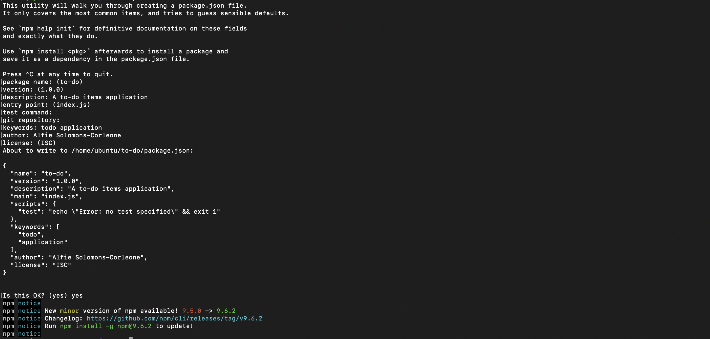

## Web (MERN) Stack implementation in AWS.

#This project demonstrates how to build a MERN Stack on AWS. MERN stack consists of MongoDB, ExpressJS, ReactJS and Node.js. Our goal here is to deploy a simple to-do application.

As shown in the above illustration, a user interacts with the ReactJS UI components at the application front-end residing in the browser. This frontend is served by the application backend residing in a server, through ExpressJS running on top of NodeJS.

Any interaction that causes a data change request is sent to the NodeJS based Express server, which grabs data from the MongoDB database if required, and returns the data to the frontend of the application, which is then presented to the user.

## .............................. Step 1: Launch an Ubuntu Server on AWS ..............................

For this project, we will need a virtual server with Ubuntu Server OS.

Sign in as either the root/IAM user (good practice is to create an IAM user and not use the root user to create resources on AWS).
Create and launch an Ubuntu EC2 instance (check videos below on how to set up your AWS account and launch your first EC2 instance).

- [AWS account setup and Provisioning an Ubuntu Server] (https://www.youtube.com/watch?v=xxKuB9kJoYM&list=PLtPuNR8I4TvkwU7Zu0l0G_uwtSUXLckvh&index=6)
- [Connecting to your EC2 Instance] (https://www.youtube.com/watch?v=TxT6PNJts-s&list=PLtPuNR8I4TvkwU7Zu0l0G_uwtSUXLckvh&index=7)

## .............................. Step 2: Backend configuration ..............................

Purpose: to prepare our server, install nodejs, npm and initialise our project.

## **Update and upgrade your Ubuntu instance:**

**`sudo apt update`**
**`sudo apt upgrade`**

## **Get the location of Node.js software from Ubuntu repositories:**

**`curl -fsSL https://deb.nodesource.com/setup_18.x | sudo -E bash -`**

## **Install Node.js on the Ubuntu server:**

**`sudo apt-get install -y nodejs`**

The command above installs both nodejs and npm. NPM is a package manager for Node like apt for Ubuntu, it is used to install Node modules & packages and to manage dependency conflicts.

## **Verify the node installation with the command below:**

**`node -v`**

## **Verify the npm installation with the command below:**

**`npm -v`**

## **Application Code Setup**

Create a new directory for the to-do project:

**`mkdir to-do`**

Run the command below to verify that the Todo directory is created with ls command

**`ls`**

Change your current directory to the newly created to-do directory:

**`cd to-do`**

You can confirm you are now in that directory using the pwd command:

**`pwd`**

Now, we need to initialise our project so that a new file named package.json will be created. This file will normally contain information about our application and the dependencies that it needs to run. Start by running the npm init command to initialise the project and follow the prompts after running the command. Use Enter to accept the default values, then accept to write out the package.json file by typing yes.

**`nmp init`**

Run the command ls to confirm that you have package.json file created.

**`ls`**

## .............................. Step 2: Install Expressjs ..............................

Purpose: to Install ExpressJs and create the Routes directory.