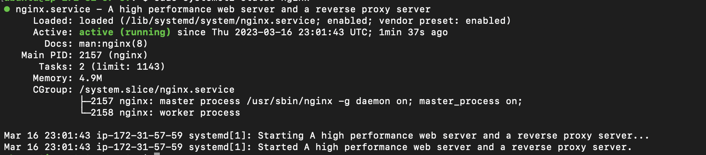
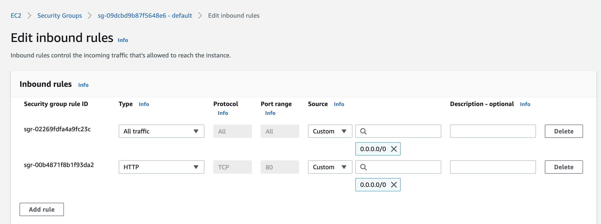
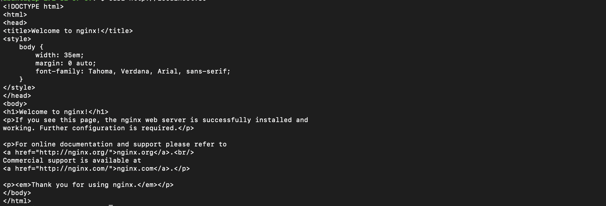
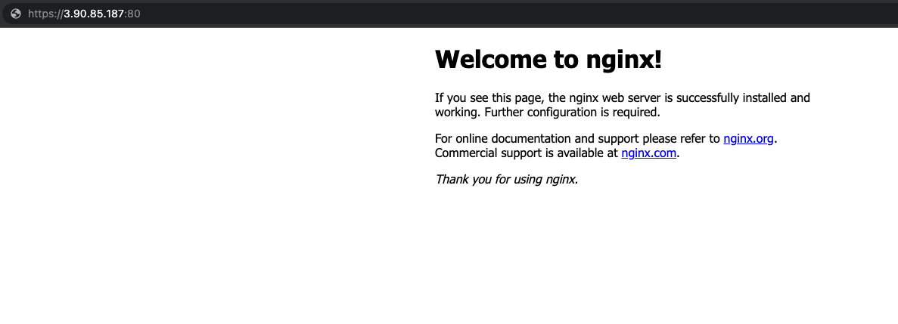
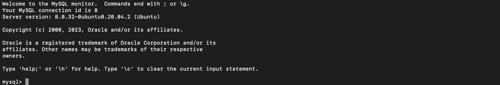
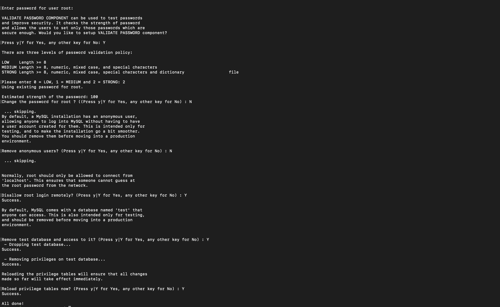

## Web (LEMP) Stack implementation in AWS.

#This project demonstrates how to build a LEMP Stack on AWS. LEMP is Linux, Engine X (Nginx), MySql, PHP.

## .............................. Step 1: Installing Nginx web server ..............................

Purpose: to serve content users will see.

Sign in as either the root/IAM user (good practice is to create an IAM user and not use the root user to create resources on AWS).
Create and launch an Ubuntu EC2 instance (check videos below on how to set up your AWS account and launch your first EC2 instance).

- [AWS account setup and Provisioning an Ubuntu Server] (https://www.youtube.com/watch?v=xxKuB9kJoYM&list=PLtPuNR8I4TvkwU7Zu0l0G_uwtSUXLckvh&index=6)
- [Connecting to your EC2 Instance] (https://www.youtube.com/watch?v=TxT6PNJts-s&list=PLtPuNR8I4TvkwU7Zu0l0G_uwtSUXLckvh&index=7)

**`sudo apt update`**

Once the update is completed, install nginx using Ubuntu’s package manager ‘apt’:

**`sudo apt install nginx`**

Verify that nginx service is running on the Ubuntu instance:

**`sudo systemctl status nginx`**

Image below shows that nginx is active and running on my Ubuntu instance:

Open TCP port 80 which is the default port that web browsers use to access web pages on the Internet so that the web server can receive traffic. To do this, edit the inbound rules on the security group attached to your Ubuntu instance to allow traffic from port 80.

Check using either of the command below to confirm the server can be accessed locally:

**`curl http://localhost:80  
or curl http://<public address>:80`**

Result:

Next, we check that the server can be accessed from the internet. On any browser, open a tab and go to http://<Ubuntu-Instance-Public-IP-Address>:80

## .............................. Step 2: Installing MySQL ..............................

Purpose: to store, manage and retrieve data.

Install MySQL on the Ubuntu instance:

 **`sudo apt install mysql-server -y`**

After the installation is completed, log in to the MySQL console:

**`sudo mysql`**

Set a password for the root user, using mysql_native_password as default authentication method. 

**`ALTER USER 'root'@'localhost' IDENTIFIED WITH mysql_native_password BY '<YOUR_PASSWORD_HERE>';`**

Exit the MySQL shell with **`EXIT`**

It is recommended to run  interactive security script that comes pre-installed with MySQL to remove some insecure default setting and lock down access to your database system.

Start the script using **`sudo mysql_secure_installation`**

After the script has finished executing, check if you can log in to the MySQL console by typing **`sudo mysql -p`**

## .............................. Step 3: Installing PHP ..............................

