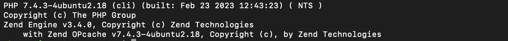
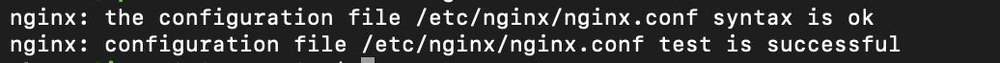
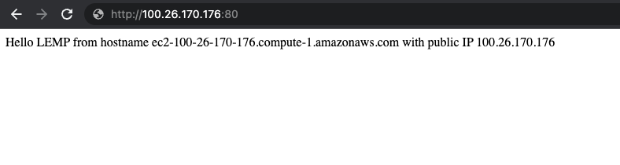
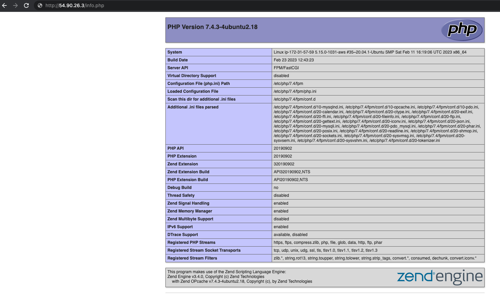

## Web (LEMP) Stack implementation in AWS.

#This project demonstrates how to build a LEMP Stack on AWS. LEMP is Linux, Engine X (Nginx), MySql, PHP.

## .............................. Step 1: Installing Nginx web server ..............................

Purpose: to serve content users will see.

Sign in as either the root/IAM user (good practice is to create an IAM user and not use the root user to create resources on AWS).
Create and launch an Ubuntu EC2 instance (check videos below on how to set up your AWS account and launch your first EC2 instance).

- [AWS account setup and Provisioning an Ubuntu Server] (https://www.youtube.com/watch?v=xxKuB9kJoYM&list=PLtPuNR8I4TvkwU7Zu0l0G_uwtSUXLckvh&index=6)
- [Connecting to your EC2 Instance] (https://www.youtube.com/watch?v=TxT6PNJts-s&list=PLtPuNR8I4TvkwU7Zu0l0G_uwtSUXLckvh&index=7)

**`sudo apt update`**

Once the update is completed, install nginx using Ubuntu’s package manager ‘apt’:

**`sudo apt install nginx`**

Verify that nginx service is running on the Ubuntu instance:

**`sudo systemctl status nginx`**

Image below shows that nginx is active and running on my Ubuntu instance:


Open TCP port 80 which is the default port that web browsers use to access web pages on the Internet so that the web server can receive traffic. To do this, edit the inbound rules on the security group attached to your Ubuntu instance to allow traffic from port 80.


Check using either of the command below to confirm the server can be accessed locally:

**`curl http://localhost:80  
or curl http://<public address>:80`**

Result:


Next, we check that the server can be accessed from the internet. On any browser, open a tab and go to http://<Ubuntu-Instance-Public-IP-Address>:80


## .............................. Step 2: Installing MySQL ..............................

Purpose: to store, manage and retrieve data.

Install MySQL on the Ubuntu instance:

 **`sudo apt install mysql-server -y`**

After the installation is completed, log in to the MySQL console:

**`sudo mysql`**


Set a password for the root user, using mysql_native_password as default authentication method. 

**`ALTER USER 'root'@'localhost' IDENTIFIED WITH mysql_native_password BY '<YOUR_PASSWORD_HERE>';`**

Exit the MySQL shell with **`EXIT`**

It is recommended to run  interactive security script that comes pre-installed with MySQL to remove some insecure default setting and lock down access to your database system.

Start the script using **`sudo mysql_secure_installation`**


After the script has finished executing, check if you can log in to the MySQL console by typing **`sudo mysql -p`**

## .............................. Step 3: Installing PHP ..............................

Purpose: to process code and generate dynamic content for the web server.

Apache embeds the PHP interpreter in each request. Nginx requires an external program to handle PHP processing and act as a bridge between the PHP interpreter itself and the web server. This allows for a better overall performance in most PHP-based websites, but it requires additional configuration. 

We need to install php-fpm (“PHP fastCGI process manager”), and tell Nginx to pass PHP requests to it for processing. Additionally, we need php-mysql, a PHP module that allows PHP to communicate with MySQL-based databases. Core PHP packages will automatically be installed as dependencies.

To install  the three packages at once, run: 

**`sudo apt install php-fpm php-mysql`**

After the installation, verify the PHP version with the command below:

**`php -v`**



Set up of the LAMP stack is complete with:

- [x] Linux
- [x] Engine X (Nginx)
- [x] MySQL
- [x] PHP

## .............................. Step 4: Configuring Nginx to use PHP processor ..............................

Purpose: to create server blocks that will encapsulate configuration details and host more than one domain on a single server. In this step, we will set up a domain called lempproject as an example.

Create the root web directory for lempproject using the command below:

**`sudo mkdir /var/www/lempproject`**

Assign ownership of the directory with the $USER environment variable. This will reference your current system user:

**`sudo chown -R $USER:$USER /var/www/lempproject`**

Create and open a new configuration file in Nginx's sites-available directory using your preferred command-line editor:

**`sudo vi /etc/nginx/sites-available/lempproject`**

Paste the following bare-bones configuration in the blank file and save:

```
#/etc/nginx/sites-available/lempproject
server {
    listen 80;
    server_name lempproject www.lempproject;
    root /var/www/lempproject;
    index index.html index.htm index.php;
    location / {
        try_files $uri $uri/ =404;
    }
    location ~ \.php$ {
        include snippets/fastcgi-php.conf;
        fastcgi_pass unix:/var/run/php/php7.4-fpm.sock;
     }
    location ~ /\.ht {
        deny all;
    }
}
```
Activate your configuration by linking to the config file from Nginx’s sites-enabled directory using command below. This tells Nginx to use the configuration next time it is reloaded.

**`sudo ln -s /etc/nginx/sites-available/lempproject /etc/nginx/sites-enabled/`**

Test configuration for syntax error with:

**`sudo nginx -t`**

You should see what's on the screenshot below. If any errors are reported, go back to your configuration file to review its contents before continuing.



Run command below to disable the default Nginx host that is currently configured to listen on port 80.

**`sudo unlink /etc/nginx/sites-enabled/default`**

Reload Nginx to apply the changes made:

**`sudo systemctl reload nginx`**

Create an index.html file in the root web directory - /var/www/lempproject to test the new server block is working as expected:

```
sudo echo 'Hello LEMP from hostname' $(curl -s http://169.254.169.254/latest/meta-data/public-hostname) 'with public IP' $(curl -s http://169.254.169.254/latest/meta-data/public-ipv4) > /var/www/lempproject/index.html
```
Now go to your browser and try to open the website URL using IP address:

**`http://<Ubuntu-Public-IP-Address>:80`**



You can leave this file in place as a temporary landing page for your application until you set up an index.php file to replace it. Once you do that, remember to remove or rename the index.html file from your document root, as it would take precedence over an index.php file by default.

The LEMP stack is now fully configured.

## .............................. Step 5: Testing PHP with Nginx ..............................

Purpose: to create a PHP script to test that Nginx is able to handle .php files in our configured website.

Create a test PHP file file in the root web directory - /var/www/lempproject:

**`sudo vi /var/www/lempproject/info.php`**

Paste the following lines into the new file. This is a valid PHP code that will return information about your server.

```
<?php
phpinfo();
```

Access the page again on your browser using:

**`http://<Ubuntu-Public-IP-Address>/info.php`**



The file contains sensitive information about your PHP environment -and your Ubuntu server, so it is advisable to remove it since you can always recreate this page if you need to access the information again later.. You can use the rm command to do so:

**`sudo rm /var/www/lempproject/info.php`**

## .............................. Step 6: Retrieving data from MySQL database with PHP ..............................